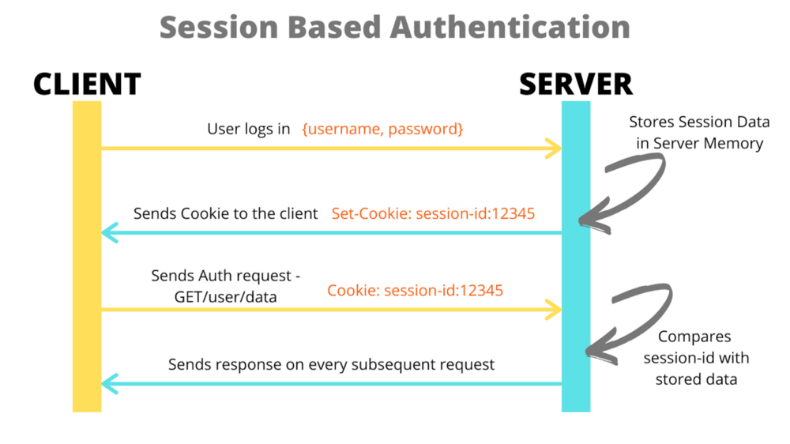
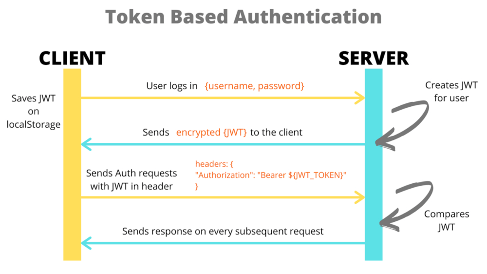

## 세션 기반 인증?

### 세션이 뭔지부터 알아보자

🔖세션이란 서버가 저장하는 사이트 방문자들에 대한 기록

- 기록엔 id, ip주소, 마지막 방문은 언제인지, 어떤 브라우저를 사용했는지 등의 정보가 담김

< 세션 기반 인증 >

- 세션 기반 인증이란 세션을 활용하여 서버에서 세션 정보 기록 후 식별 id를 Set-Cookie로 클라이언트에 응답한다.

- 클라이언트가 서버에 요청 시 서버에서 응답한 쿠키를 자동으로 포함하며 서버가 클라이언트의 쿠키에 담긴 세션 id만 확인하여 방문자를 파악한다.

- 유저가 로그인하게 되면 서버에서 세션에 유저 id를 저장 후 이를 기반으로 서버가 요청을 보낸 유저를 특정한다.

- 세션은 일정한 기간이 지나거나 클라이언트에서 로그아웃 요청을 보낼 경우, 해당 세션이나 로그인 유저를 만료 처리한다.

 

## 토큰 기반 인증

### 인증 토큰

- 토큰 기반 인증이란 인증 토큰을 사용하며, 인증 토큰이란 유저에 대한 정보를 암호화한 문자열을 지칭

- 특정 콘텐츠에 접근할 수 있게 해주기 때문에 Access token이라고도 칭하며, 최근의 토큰 형식은 JWT(JSON Web Token)형식을 가장 많이 사용

< 토큰 기반 인증 >

- 토큰 기반 인증은 세션 기반 인증과 달리 유저의 로그인 상태를 저장하고 요청이 올 때마다 저장 및 확인하지 않고도 토큰 자체를 해석하여 요청을 보낸 유저의 식별이 가능하다.

< 토큰 식별 흐름 >

1. 유저가 이메일 비밀번호를 입력해 로그인 요청을 하면 서버가 유효한지 확인한다.

2. 서버는 유저를 식별할 수 있는 id, 만료일 등의 내용을 담은 토큰을 만들어 클라이언트에게 응답한다.

3. 응답으로 인증 토큰을 응답의 바디로 넘기기도 하고, Set-Cookie를 하기도 합니다. 이 토큰은 담고싶은 정보와 서버에서만 알고 있는 비밀키를 활용해 만들어진 사용자가 식별할 수 없는 문자열이다.

4. 클라이언트는 응답으로 받은 토큰을 서버에 요청할 때 Authorization 헤더에 담아 전송한다.

5. 서버는 클라이언트의 토큰을 비밀키를 사용해 다시 해석하고 유효성 검증 및 유저를 특정한다. 인증 토큰을 사용하면 문자열 토큰을 갖고 있기만 하고 만료시간이 지나지 않았으면 항상 로그인 상태를 유지할 수 있습니다.

6. 로그아웃을 하고 싶으면 클라이언트에서 직접 저장한 토큰을 삭제한다.

## 비교

✨효율성

- 세션 기반 인증을 사용하면 서버는 항상 로그인 세션 정보를 저장하며, 매 리퀘스트의 유저가 누구인지를 정보와 비교해야 한다.

- 이를 위해 용량과 시간을 소비하며 로그인한 유저가 엄청 많거나 특정 시간에 몰리게 되면 서버의 리퀘스트 처리 속도가 감소할 수도 있다.

- 반면에 토큰 기반 인증은 어딘가 저장한 데이터와 비교하는 게 아니라 토큰 자체 내용을 해석하기만 하면 되기 때문에 더 효율적으로 작동할 수 있다.

✨유연성

- 토큰 기반 인증은 세션 기반 인증보다 조금 더 유연하게 사용 가능하며 토큰을 발행하는 방법이 똑같고, 시크릿 키만 있으면, 발행한 곳과 확인하는 곳이 달라도 무방하다.

- 여러 서비스가 같은 방식 및 시크릿 키를 사용하여 토큰을 발행한다면 공유하는 사이트들은 모두 이를 해석해 유저를 파악할 수 있다. 따라서 유연하게 다양한 서비스를 하나의 계정으로 사용 가능해진다.

- RESTFUL API
- 세션 정보와 같이 서버가 "상태" 정보를, 예를 들어 유저가 로그인을 했는지 안 했는지 저장하고 있을 때, stateful 하다고 표현한다.

- 하지만 REST에 부합하기 위해서는 서버가 상태 정보를 저장하지 않는, stateless 한 특성이 있어야 하며, 이는 곧 서버는 클라이언트에서 보내는 정보만으로 충분히 상태를 파악할 수 있어야 한다는 것을 의미한다.

- 따라서 RESTFUL한 API 서버를 만들고 있다면 세션 기반 인증보다 토큰 기반 인증이 더 낫다.

✨무효화

- 세션 기반 인증의 장점 중 하나는 바로 서버에서 세션 데이터를 따로 관리하기 때문에 특정 세션을 손쉽게 무효화할 수 있다는 것이다.

- 따라서 문제 발생 시에 세션을 관리하는 테이블에 가서 상태를 만료로 바꾸거나 만료일을 지금으로 해버리면 되겟지만, 토큰 기반 인증을 사용하면 따로 서버가 상태 정보를 저장하지 않기 때문에 특정 토큰을 무효화하는 게 더 복잡해진다.

- 이중 비밀번호나, OTP같이 이를 방지하기 위한 방법들이 있지만, 세션 기반 인증을 사용하면 한 가지 안전장치를 더 쉽게 사용할 수 있습니다.
