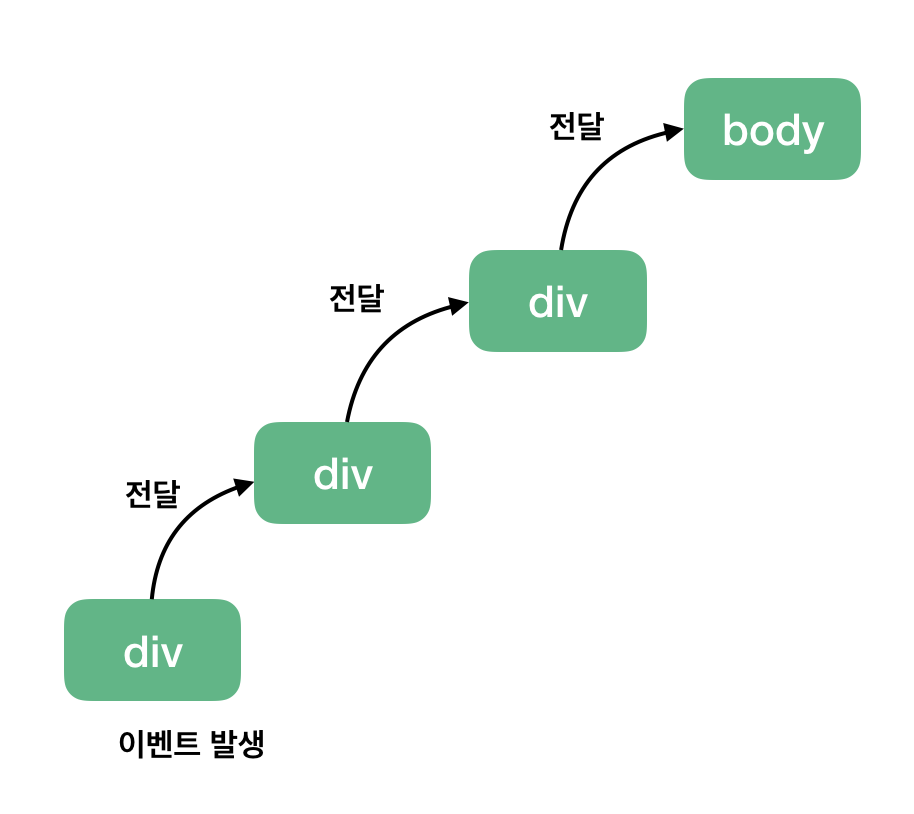

🔖**DOM의 이벤트 흐름은 캡쳐링 -> 타깃 -> 버블링 순서로 이루어진다.**

### 이벤트 버블링

---

🔖이벤트 버블링은 특정 화면 요소에서 이벤트가 발생했을 경우, 해당 이벤트가 더 상위(부모) 요소들로 전달되는 특성을 의미한다.

```html
<div>
  <div class="one">
    <div class="two">
      <div class="three"></div>
    </div>
  </div>
</div>
```

❗특정 태그 전체에 이벤트를 등록하고, 최하위 태그 요소의 이벤트를 동작하면 자식->부모 순서로 이벤트에 해당하는 코드가 실행된다.
✅특정 태그만 선택한 것이 아닌, 모든 태그를 선택하여 이벤트를 부여하고 특정 태그에 이벤트를 동작시키면 브라우저가 해당 태그의 모든 상위 태그에 이벤트를 전파시킨다.


### 이벤트 캡쳐링

---

🔖이벤트 버블링과 반대로 부모 요소에서 자식 요소로 이벤트가 전파되는 것을 의미한다. (자주 나오는 개념은 아니다.)

```js
const divs = document.querySelectorAll("div");
divs.forEach((div) => {
  div.addEventListener("click", logEvent, true);
});
```

✅위와 같이 이벤트 리스너의 세번째 파라미터로 true를 주면 이벤트 캡쳐링을 동작시킬 수 있다.

### 이벤트 위임

---

🔖버블링, 캡쳐링과 같은 특징을 활용해 하위 요소가 아닌 상위 요소에서 이벤트 핸들링을 하여 하위 요소까지 제어하는 방식이다.

```html
<ul id="to-do-list">
  <li class="item">자바스크립트 공부하기</li>
  <li class="item">고양이 화장실 청소하기</li>
  <li class="item">고양이 장난감 쇼핑하기</li>
</ul>
```

```js
function updateToDo(event) {
  if (event.target.tagName === "LI") {
    event.target.classList.toggle("done");
  }
}
toDoList.addEventListener("click", updateToDo);
```

✅위 코드와 같이 상위 요소인 ul에 click 이벤트를 부여하고, 조건식을 통해 부모에겐 영향을 주지 않으면서 이벤트 위임을 사용하며, 새로 추가될 자식 요소에게도 전부 이벤트를 부여할 수 있도록 한다.
