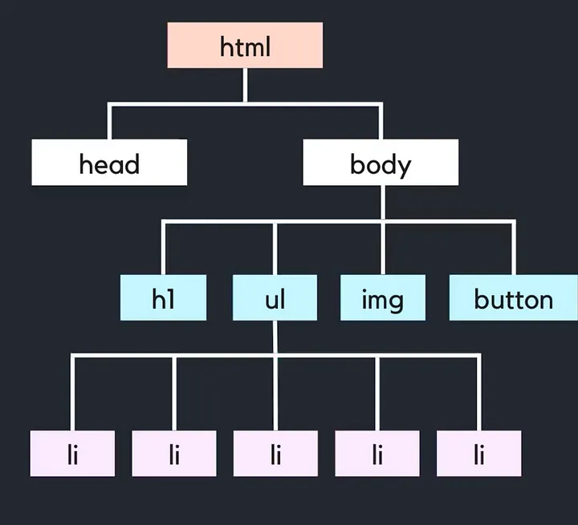
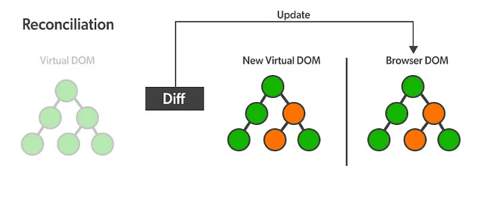

### DOM

---

🔖각각의 Element를 담은 웹페이지를 Document라고 하며, 브라우저는 이를 분석하여 화면상에서 보여준다.
✅DOM은 이러한 Element들을 tree 형태로 표현한 것으로 이에 해당하는 Node로 구성되어 있으며, DIM이 제공하는 API를 통해 구조에 접근하고 Element를 관리한다.


### Virtual DOM

---

🔖Virtual DOM은 실제 DOM과 같은 내용을 담고 있는 복사본이라 할 수 있으며, 자바스크립트 객체의 형태로 존재한다.
✅변화를 감지하면 재조정(re-Rendering) 과정을 통해 실제 DOM과 동기화한다.

```
1. UI 변경 감지 및 Virtual DOM 렌더링
2. 현재 Virtual DOM과 이전 Virtual DOM을 비교해 차이 계산(Diffing)
3. 변경된 부분 실제 DOM에 반영(re-Rendering)
```



❗리액트는 노드를 비교할 때 얕은 비교를 하므로, useState를 사용하더라도 같은 참조 위치를 가진 참조형 값의 변경을 통해서는 감지할 수 없다. (객체의 불변성을 유지)
✅re-Rendering이 효율적인 이유는 **Batch Update** 때문인데, 이는 Element들을 집단화 시켜 한번에 실제 DOM에 적용하기 때문에 비용 절감과 더불어 효율적인 퍼포먼스를 보여준다.

### Virtual DOM의 장, 단점

---

🔖장점

```
1. 성능
  실제 DOM 조작은 비용이 매우 큰 작업이기 때문에 Virtual DOM을 활용한 조작은 DOM 조작의 최소화를 통해 렌더링 성능을 향상시킨다.
2. 일관성
  Virtual DOM은 상태 변화 추적 및 변경 사항 적용의 타이밍이 알맞아 렌더링 일관성이 유지된다.
3. 복잡한 UI 관리
  컴포넌트 기반 아키텍쳐의 효과, 효율적인 관리가 가능하다.
4. Cross-Platform 지원
  브라우저 독립적인 방식으로 동작하기 때문에, React Native와 같은 플랫폼에서도 활용이 가능하다.
```

🔖단점

```
1. 추가적인 메모리 사용
  실제 DOM과 동일한 구조의 메모리를 유지하므로, 추가적인 메모리 사용이 불가피하다.
2. 복잡성 증가
  개발자가 App의 뷰와 상태를 동기화 하기 때문에 추가적인 추상화계층이 요구된다.
```
