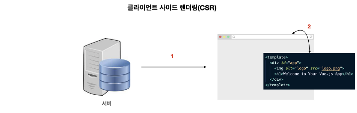
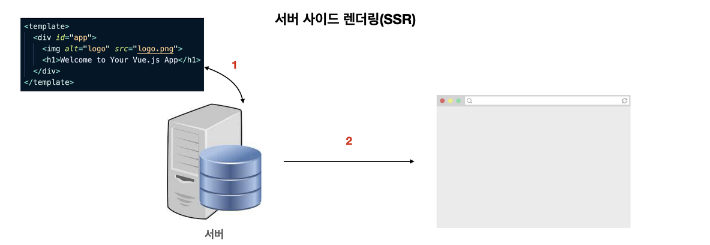
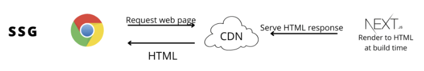

### CSR

---

🔖브라우저(클라이언트)에서 전적으로 웹 렌더링을 책임지는 보편화된 방식이며, 최초에 서버가 보내준 빈 HTML에 브라우저가 요소를 채워 렌더링한다.

➡️서버로부터 HTML를 받는 것 이외에 별도의 통신을 할 필요가 없다.(SPA) 따라서 한번 렌더링 후 필요한 부분만 렌더링하여 효율적이다.

✅초기 로딩 후 빠른 렌더링을 통해 UX를 증대시키며, 서버의 부담이 덜하다. 또한 TTV와 TTI의 간극이 없다.
🚫모든 파일이 처음에 전부 로드되어야 하므로 초기 로딩속도가 느리고, 검색엔진 최적화에 불리하다.

👍초기 로딩만 제외하면 빠른 속도와 필요한 데이터만 받아와 렌더링한다는 장점이 있어 사용자 간 상호작용이 많고 동적으로 데이터를 받아올 일이 많은
SNS피드, 채팅앱 등과 같은 페이지에서 사용하기 좋다.

### SSR

---

🔖브라우저가 서버에 페이지를 요청 시 서버가 이를 HTML로 구성해 전송하고, 브라우저가 이를 렌더링하는 방식이다.

➡️페이지 로드에 필요한 데이터를 서버에서 이미 불러오기 때문에 별도로 브라우저가 JS코드를 불러올 필요가 없어진다.

✅초기 로딩 속도가 빨라 사용자 입장에서 콘텐츠를 빠르게 볼 수 있으며, 검색엔진 최적화에 유리하다.
🚫매번 서버로부터 페이지를 전달받아 생성 시간이 소요되며, TTV와 TTI간의 간극이 존재한다. 또한 서버의 부하가 커질 수 있고 비용도 높다.

👍검색엔진 최적화에 유리하므로 블로그나 뉴스 등의 컨텐츠를 제공하는 페이지에서 사용하기 좋다.

### SSG

---

🔖페이지를 한번만 생성하고 필요할 때마다 꺼내어 렌더링하는 방식이다. SSR과 CSR를 동시에 사용할 수 있게한다.

➡️정적 파일로만 구성되어 있기 때문에 CDN을 통해 캐싱하여 빠른 제공이 가능하다.

✅사전 렌더링된 파일을 제공하기 때문에 부하 및 비용이 적고, 빠르게 제공할 수 있으며, 보안에 좋다.
🚫동적인 콘텐츠는 제한되며, 주로 클라이언트 사이드 중점의 정적 콘텐츠를 생성하여 서버 측 로직에 불리할 수 있다.

👍정적인 페이지로서 불러오기만 하면 되므로, 동적인 콘텐츠가 없는 회사 소개 페이지나 문서 등을 제공하는 페이지에서 사용하기 좋다.
