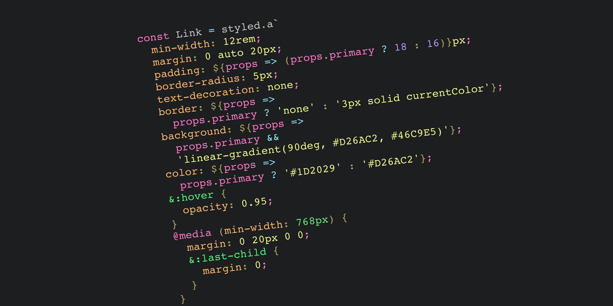

### CSS in JS

---

🔖CSS in JS는 CSS 스타일을 JS 코드 안에 포함하여 작성하는 패턴을 의미한다. 대표적인 라이브러리로 "Styled-components"가 있다.

✅장점

- 스타일을 JS 파일에 직접 작성함으로서 캡슐화에 유리하다. 이를 통해 스타일 간의 충돌을 완화하고 유지보수를 용이하게 만든다.
- JS코드와 비슷한 작성법을 이용하여 동적으로 스타일링하기에도 용이하다.
- CSS 로드 우선순위 이슈 또한 해결할 수 있다.

🚫단점

- 기존의 CSS 작성법과는 어느정도 차이가 있다보니 학습 곡선이 높다.(실제로 내가 그렇다.)
- JS를 통해 스타일이 동적으로 생성되어 성능 오버헤드가 발생할 수 있다.
- 일부 브라우저에서 지원되지 않을 수 있다.

➡️솔직히 아직까진 기존의 작성법이 편하기도 하고, 현재는 Tailwind 등 간단하고 효율좋은 CSS 프레임워크도 있기 때문에 굳이 채택하고 싶은 생각은 들지 않는다.
