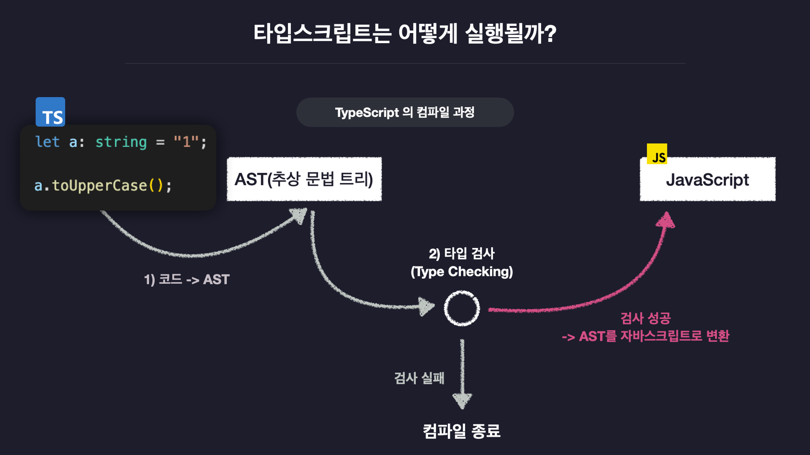

### 타입스크립트는 뭐지?

---

🏷️자바스크립트를 포함하는 상위 확장자(superset)이라고 할 수 있으며, 기존의 동적 타이핑 언어이던 자바스크립트에 타입을 부여하여 정적 타이핑 언어로 변환한 언어를 지칭

🔖자바스크립트를 기반으로 동작하기 때문에, 사용되려면 자바스크립트로 변환되는 "컴파일" 과정을 거쳐야 한다.

### 타입스크립트를 사용하는 이유는?

---

🏷️타입을 정의하여 사전에 버그를 예방 가능하다.

- 타입스크립트는 컴파일 과정에서 타입을 결정
- 컴파일 과정에서 타입을 정의하기 때문에 컴파일 시 에러 예방

🏷️높은 생산성을 제공한다.

- 기존 자바스크립트와 다르게 변수의 이름 뿐 아니라 데이터의 자료형까지 전부 파악 가능

🏷️강력한 호환성을 가진다.

- 기존 자바스크립트의 상위 확장자이므로, 자바스크립트 코드를 가지고 확장하는 형식으로 수저없이 사용 가능

### 자바스크립트와의 차이

---

🏷️동적 타입 언어 vs 정적 타입 언어

- 자바스크립트는 런타임 환경에서 타입을 결정하는 동적 타입 언어
- 타입스크립트는 사전에 타입을 정의하고 사용하는 정적 타입 언어

🏷️컴파일 언어 vs 인터프리터 언어

- 자바스크립트는 소스코드를 한 줄씩 읽어가며 명령을 처리하는 인터프리터 언어
- 타입스크립트는 사전에 기계어로 변환 후 한번에 실행하는 컴파일 언어

### 타입스크립트의 동작 원리

---

1. 텍스트를 컴파일러 프로그램이 파싱하여 **추상 문법 트리(AST)** 라는 자료구조로 변환
2. 컴파일러 프로그램이 타입확인 과정을 거쳐 AST를 자바스크립트 코드로 변환
