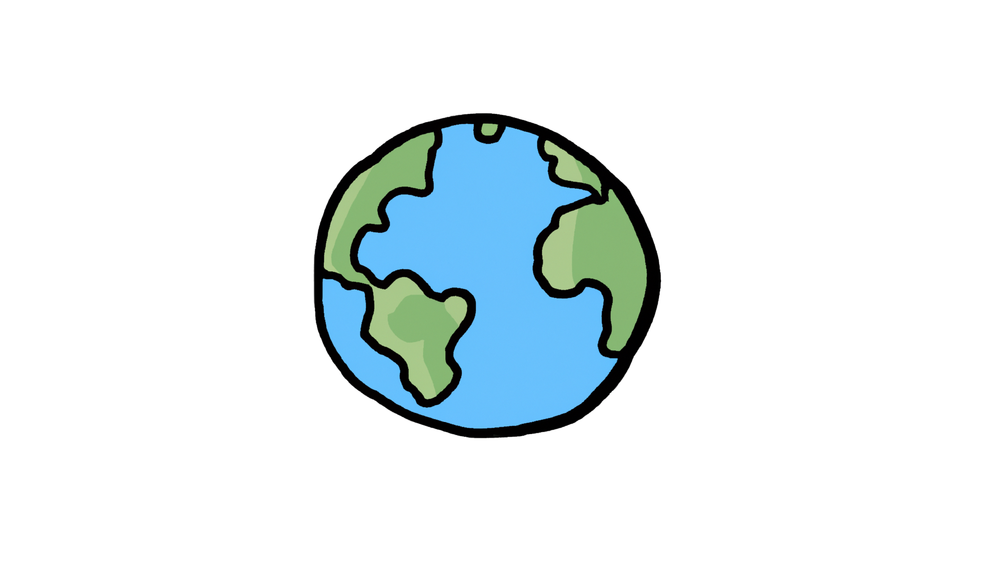

오랜만에 웹 공부를 하면서 만들어봤다.
![[Pasted image 20240207141341.png]]
사진상으론 안보이지만 왼쪽의 지구는 자전하는중 ㅋㅋ

### HTML
기본적으로 main-container에 좌우로 div를 나누어 작성해서 CSS 코드 작성이 조금더 간편하도록 작성했다.
```HTML
<!-- 생략 -->
<body>
  <div class="main-container">

    <div class="img-container"> <!-- 이미지 부분 -->
      
    </div>

    <form class="login-form" novalidate> <!-- 로그인 폼 -->

      <div class="id-container">
        <label for="id">ID</label>
        <input type="text" id="id" placeholder="Enter Your ID"
        autocomplete="off" required>
        <i class="fa-solid fa-check"></i>
      </div>

      <div class="pw-container">
        <label for="pw">Password</label>
        <input type="password" id="pw" placeholder="Enter Your PW" maxlength="10"
        required>
        <i class="fa-solid fa-check"></i>
      </div>

      <div class="email-container">
        <label for="email">Email</label>
        <input type="email" id="email" placeholder="Enter Your Email"
        autocomplete="off" required>
        <i class="fa-solid fa-check"></i>
      </div>

      <div class="phone-container">
        <label for="id">Phone</label>
        <input type="text" id="phone" placeholder="Enter Your Phone without ' - '"
        autocomplete="off" required>
        <i class="fa-solid fa-check"></i>
      </div>

      <div class="btn-container">
        <button type="submit" id="submit-btn">Submit!</button>
      </div>
    </form>
  </div>
  <script src="script.js"></script>
</body>
```

### CSS
각 태그들의 배치를 원하는대로 하기위해 display:flex 속성을 적극 활용했다.
```CSS
/* main */
.main-container{
  width: 60%;
  display:flex;
  margin:auto;
  border:2px solid;
  height: 80vh;
  border-radius: 18px;
  border:none;
  box-shadow: 0 0 30px rgba(36,51,106,0.7);
  transition: all 0.5s linear;
  background-image: url(./assets/backimg.jpg);
  background-size: cover;
  background-repeat: no-repeat;
  object-fit: cover;
}
.main-container:hover{
  box-shadow:0 0 25px rgba(36,51,106,0.4);
}

/* img */
/* main-container의 왼쪽에 해당하는 부분 */
.img-container{
  width:50%;
  padding: 25px;
  display:flex;
  align-items: center;
  height: 100%;
  justify-content: center;
}
.img-container img{
  width: 100%;
  object-fit: cover;
  /* 애니메이션이 종료되는 시점의 끊기는 느낌을 없애려고 아예 시간을 늘려버림 */
  animation: binggle 100000s infinite; 
}

@keyframes binggle{
  0%{
    transform: rotate(0);
  }
  100%{
    transform: rotate(3600000deg);
  }
}

/* login */
/* main-container의 오른쪽에 해당하는 부분 */
.login-form{
  width: 50%;
  padding:35px;
  display:flex;
  flex-direction: column;
  justify-content:space-around; 
}
.login-form div{
  position:relative;
}
.login-form label{
  position: relative;
  left:5px;
  bottom:7px;
  color:rgba(256,256,256,0.8);
}

.login-form input{
  width: 100%;
  height: 6vh;
  padding: 10px;
  border-radius: 10px;
  outline: none;
  border:solid 2px rgba(256,256,256,0.8);
  color:rgba(256,256,256,0.8);
  background-color: transparent;
  transition: all 0.5s linear;
}

.login-form input::placeholder{
  color:rgba(256,256,256,0.8);
}
/* focus 되는 부분은 box-shadow 속성을 이용해 효과를 부여 */
.login-form input:focus{
  box-shadow: 0 0 20px rgba(256,256,256,0.3);
}

.login-form div.success i.fa-check{
  color:rgb(1, 169, 1);
}
.login-form div.fail i.fa-exclamation{
  color:rgb(215, 0, 0);
}
.login-form div.success input{
  border:solid 2px rgba(1,169,1,0.8);
}
.login-form div.fail input{
  border:solid 2px rgba(215,0,0,0.8);
}
/* input 태그에 작성해야하는 요소가 유효하지 않을 경우 아이콘 추가 */
i.fa-check{
  position:absolute;
  color:transparent;
  right: 4%;
  top:53%;
}

i.fa-circle-exclamation{
  position:absolute;
  color:red;
  right: 4%;
  top:53%;
  bottom: 50%;
}

.login-form button{
  width: 100%;
  height: 8vh;
  margin-top: 20px;
  border-radius: 10px;
  background:transparent;
  color:rgba(256,256,256,0.8);
  border:solid 2px rgba(256,256,256,0.8);
  cursor: pointer;
  transition: all 0.5s linear;
  font-size: 16px;
  outline: none;
}

/* 로그인 성공과 실패를 submit 버튼의 애니메이션 효과로 표현 */
.login-form .non-submitted button{
  animation: deoldeol 0.1s infinite;
  animation-iteration-count: 3;
}

.login-form .submitted button{
  animation: banggeut 0.5s linear;
}

@keyframes banggeut{
  0%{
    transform: translateY(0px);
  }
  50%{
    transform: translateY(-5px);
  }
  100%{
    transform: translateY(0px);
  }
}

@keyframes deoldeol{
  0%{
    transform: translateX(-5px);
  }
  100%{
    transform: translateX(5px);
  }
}

.login-form button:hover{
  box-shadow: 0 0 30px rgba(256,256,256,0.5);
}
```

### JavaScript
로그인 폼의 유효성 검사와 submit 이벤트 발생시 적용되는 함수 작성 및 로그인 버튼의 애니메이션 효과 컨트롤
```js
const divs = document.querySelectorAll(".login-form div:not(:last-child)");
const form = document.querySelector('.login-form');
const inputs = document.querySelectorAll('.login-form input');

const idicon = divs[0].querySelector('.fa-solid');
const pwicon = divs[1].querySelector('.fa-solid');
const emailicon = divs[2].querySelector('.fa-solid');
const phoneicon = divs[3].querySelector('.fa-solid');

// test 변수에 유효성 검사의 boolean 값을 넣어 조건문을 통해 각각의 상황 구현
function handleClass (test, icon, div){
  if(test){
    icon.classList.remove('fa-circle-exclamation');
    icon.classList.add('fa-check');
    div.classList.remove('fail')
    div.classList.add('success');
  }else if(!test){
    icon.classList.add('fa-circle-exclamation');
    icon.classList.remove('fa-check');
    div.classList.remove('success');
    div.classList.add('fail');
  }else if(!div.classList.contains('success') || !div.classList.contains('fail')){
    icon.classList.add('fa-circle-exclamation');
    icon.classList.remove('fa-check');
    div.classList.remove('success');
    div.classList.add('fail');
  }
}

// submit 이벤트 발생 시 성공 or 실패에 따라 각각 다른 효과 발생생
function submit(e) {
  e.preventDefault();
  const btnContainer = document.querySelector(".btn-container");
  const submitBtn = document.getElementById('submit-btn');
  const arr = Array.from(divs);

  if (arr.every(item => item.classList.contains('success'))) {
    btnContainer.classList.add('submitted');
    btnContainer.classList.remove("non-submitted");
    submitBtn.textContent = 'Submitted!';
    submitBtn.style.color = "rgba(1,169,1,0.8)";
    submitBtn.style.border = "solid 2px rgba(1,169,1,0.8)";
  }else{
    btnContainer.classList.add('non-submitted');
    btnContainer.classList.remove('submitted');
    submitBtn.textContent = 'Failed!';
    submitBtn.style.color = "rgba(215,0,0,0.8)";
    submitBtn.style.border = "solid 2px rgba(215,0,0,0.8)";
  }

  setTimeout(() => {
    submitBtn.textContent = 'Submit!';
    submitBtn.style.color = "rgba(256,256,256,0.8)";
    btnContainer.classList.remove('non-submitted');
    btnContainer.classList.remove('submitted');
    submitBtn.style.border = "solid 2px rgba(256,256,256,0.8)"
  }, 1000);
}

// 유효성 검사
function isValidId () {
  const isValid = /^[A-Za-z0-9]{4,12}$/;
  let test = isValid.test(inputs[0].value);

  handleClass(test, idicon, divs[0]);
}
function isValidPw () {
  const isValid = /^(?=.*[A-Za-z])(?=.*\d)(?=.*[@$!%*#?&])[A-Za-z\d@$!%*#?&]{8,12}$/; 
  let test = isValid.test(inputs[1].value);

  handleClass(test, pwicon, divs[1]);
}
function isValidEmail () {
  const isValid = /^[A-Za-z0-9_\.\-]+@[A-Za-z0-9\-]+\.[A-za-z0-9\-]+/;
  let test = isValid.test(inputs[2].value);

  handleClass(test, emailicon, divs[2]);
}
function isValidPhone () {
  const isValid = /^[0-9]{10,}/;
  let test = isValid.test(inputs[3].value);

  handleClass(test, phoneicon, divs[3]);
}

// 이벤트 핸들러
inputs[0].addEventListener('input', isValidId);
inputs[1].addEventListener('input', isValidPw);
inputs[2].addEventListener('input', isValidEmail);
inputs[3].addEventListener('input', isValidPhone);
form.addEventListener('submit', submit);
```

![[Pasted image 20240207143539.png]]
![[Pasted image 20240207143432.png]]
쭉 가보자고~