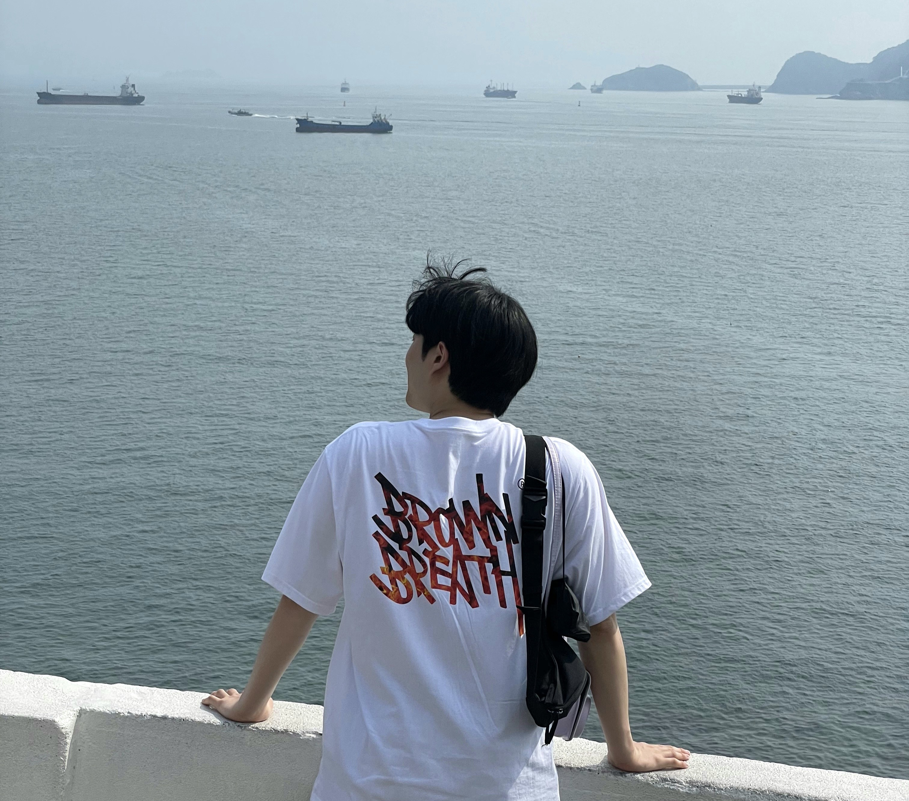

### 13.3 메인 영역 만들기

- HTML 코드 작성하기
시멘틱 태그인 main 태그 활용
기준 너비 유지를 위한 container 클래스가 포함된 div 태그 안에 코드 작성
```HTML
<main id = "main">

        <div class = "container">

            <h4>Welcome🖐️</h4>

            <h2>I'M A <span></span></h2>

            <p>시작이 반이다.</p>

            <button class = "download">DOWNLOAD CV</button>

            <button class = "mouse"><i class="fa-solid fa-computer-mouse"></i></button>

        </div>

    </main>
```

- CSS 코드 작성하기
background 속성 url() 함수로 삽입 이미지 경로 지정
텍스트 별로 크기, margin 속성 지정정
```CSS
main{

    width:100%;

    height:100vh;

    color:white;

    background: linear-gradient(rgba(0,0,0,0.8), rgba(0,0,0,0.8)), url('images/me.jpg')

    center center;

    background-size: cover;

    display:flex;

    justify-content: center;

    align-items: center;

    text-align: center;

}

main h4{

    font-size: 2rem;

}

main h2{

    font-size: 3.5rem;

    margin:2rem 0;

    letter-spacing: 3px;

}

main p{

    max-width:500px;

    margin:0 auto;

    font-size:1.25rem;

}
```
background-color 속성으로 배경을 투명하게 하고 시작(기본)
요소 내, 외부 간격을 padding과 margin 속성으로 지정
```CSS
main button.download{

    background-color:transparent;

    border:3px solid white;

    border-radius: 20px;

    padding : 1rem 2rem;

    margin-top: 3rem;

    color:white;

    font-weight: bold;

    cursor:pointer;

}
```
아이콘 폰트 추가 마우스 모양 버튼에 스타일 속성 지정(애니메이션 활용용)
```CSS
main button.mouse{

    background-color:transparent;

    border:none;

    color:white;

    font-size:2rem;

    position:absolute;

    bottom:1rem;

    left:50%;

    transform:translateX(-50%);

    animation:upDown 1s ease-in-out infinite;

    cursor:pointer;

  }

  @keyframes upDown{

    0%{

      bottom:1rem;

    }

    50%{

      bottom:1.5rem;

    }

    100%{

      bottom:1rem;

    }

  }
```
화면 텍스트 끝부분 커서모양 제작작
```CSS
main h2 span::after{

    content:"";

    height:40px;

    width:3px;

    background-color: #fff;

    display: inline-block;

    animation: blink .7s ease-in-out infinite;

}

@keyframes blink{

    0%{

        opacity:1;

    }

    100%{

        opacity:0;

    }

}
```

### 13.4 섹션 영역 만들기 : About Me

- HTML 코드 작성하기
section 태그로 섹션 영역을 모두 표시하되, 각 영역을 구분(클래스 속성값 활용)
```HTML
<section id = "about" class = "about">

        <div class = "container">

            <div class = "title">

                <h4>Who Am I</h4>

                <h2>About Me</h2>

            </div>

            <div class = "about-self">

                <div class = "left">

                    

                </div>

                <div class = "right">

                    <h3>Hello, <strong>I'm CoGI</strong></h3>

                    <p>I'm Web Front-End BABY Developer.</p>

                    <p>Although it is an embarrassing skill to call myself a developer now,<br>

                    I am confident that I will grow through constant study.</p>

                    <div class = "social">

                        <a href = "#">

                            <i class = "fa-brands fa-facebook"></i>

                        </a>

                        <a href = "#">

                            <i class = "fa-brands fa-instagram"></i>

                        </a>

                        <a href = "#">

                            <i class = "fa-brands fa-youtube"></i>

                        </a>

                    </div>

                </div>

            </div>

        </div>

    </section>
```

- CSS 코드 작성하기
글꼴 적용 밑 :nth-child() 선택자로 짝수번째 섹션 영역 배경색 회색계열 지정
```CSS
section{

    font-family:"Poppins", sans-serif;

    padding:5rem 0;

}

section:nth-child(2n){

    background-color: #f8f8f8;

}
```

```CSS
section .title{

    margin-bottom: 3rem;

}

section .title h4{

    font-size:1.35rem;

    color:#ed4848;

    position:relative;

}

section .title h2{

    font-size:3.5rem;

}

section .title p{

    font-size:1.15rem;

}
```
본문이 텍스트, 이미지를 좌우로 나누기 때문에 float 속성으로 레이아웃 분할 밑 절반 차지 지정
float 속성이 대상의 원래 위치를 보장하지 않으므로, clear 속성으로 float 속성 해제
img 태그 max-width 속성으로 이미지가 부모요소보다 커지지 못하게 제한한
```CSS
/*float 속성 해제*/

section .about-self::after{

    content:"";

    clear:both;

    display:block;

}

/* 본문 너비 절반 지정 & 왼쪽 배치 */

section .about-self .left{

    width:50%;

    float:left;

}

/*이미지 크기가 부모 영역을 넘지 않도록 부모 영역 최대 크기 지정 */

section .about-self .left img{

    max-width: 100%;

}

/* 본문 너비 절반 지정 & 오른쪽 배치 */

section .about-self .right{

    width:50%;

    float:left;

    padding: 0 2rem;

}
```

```CSS
/* 본문 오른쪽 h3 태그의 글자 크기와 여백 지정 */

section .about-self .right h3{

    font-size:2.25rem;

    margin-bottom:1rem;

}

/* 본문 오른쪽 h3 태그의 strong 태그 색상 강조 */

section .about-self .right h3 strong{

    color:#ed4848;

}

/* 본문 오른쪽 p태그 크기와 여백 지정 */

section .about-self .right p{

    font-size:1.15rem;

    margin: 1rem 0;

}

/* 본문 오른쪽의 아이콘 폰트 크기와 여백 지정 */

section .about-self .right .social a{

    font-size:2.5rem;

    margin-right:0.2rem;

}
```